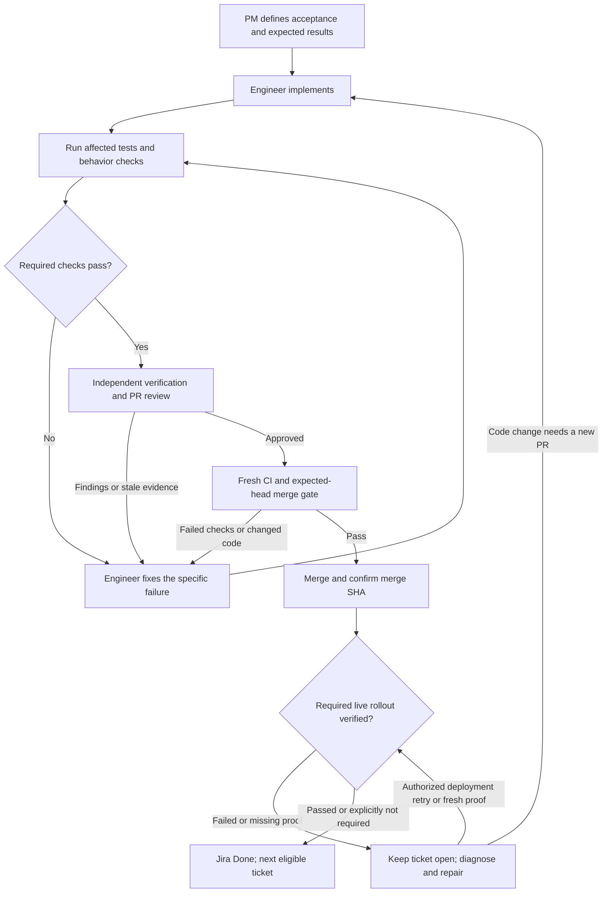

# SStack

A shared PM → engineer → verification → review → merge workflow for **Claude Code
and Codex**, designed for individual repositories and monorepos. SStack evolves
the Kizen Stack into a portable skill bundle, with Kizen-first design when the
project uses Kizen.

Give the PM a goal and project folder. It breaks the outcome into Jira work,
assigns ready tickets to engineer agents, validates the results, coordinates
independent review, merges eligible PRs, verifies required rollout, updates Jira,
and picks up the next ticket within the goal. Failed gates return work for fixes;
an open PR or a merged configuration file alone is not delivery proof.

## Why the verification loop matters

Autonomous delivery needs a reliable way to distinguish a completed outcome from
an agent's claim that it finished. Code can compile while calculating the wrong
answer. A Kizen workflow can run while updating the wrong record. A PR can merge
while the deployed UI still shows old behavior. Each needs a different check.

SStack defines the expected outcome before implementation, binds evidence to the
actual version tested, and sends failures back for correction. Independent review
helps catch assumptions shared by the implementation and its tests. This gives
routine work a path to completion without asking a person to approve every step,
while keeping missing proof visible.



Missing access or a consequential product decision pauses the affected work;
it is not a reason to retry forever. After a code change, refresh affected tests
and independent review for the new commit. Never change expected results just to
make a failed implementation pass. A post-merge code repair uses a new PR and its
own delivery cycle; it does not rewind the merged controller record.

### Demonstration: portfolio allocation

This is an illustrative feature, not a portfolio application included in SStack.
The goal is to show allocation **by holding value**. PM freezes this example
before dispatch: stocks worth $6,000 and bonds worth $4,000 must display 60% stocks
and 40% bonds. PM also specifies which checks run before merge and which require
the deployed environment.

| Step | Observation | Gate decision |
| --- | --- | --- |
| Engineer builds | The implementation counts holdings: one stock and one bond, giving 50% / 50%. Build and lint pass. | Build success does not meet acceptance. |
| Verifier checks | Actual 50% / 50% differs from expected 60% / 40%. | Fail; PM returns the counterexample to the engineer. |
| Engineer fixes | Calculate each category's value divided by the $10,000 total. | Rerun the case and relevant regressions; keep the same expectation. |
| Independent agent verifies | Fresh results show 60% / 40%; the UI and saved values agree in the declared test environment. | Record evidence against the new commit and review its diff. |
| PM checks merge gates | Required acceptance, review and CI pass for the current PR head. | Merge and read back the actual merge SHA. |
| Verifier checks rollout | The intended deployed environment shows the same outcome for the synthetic holdings. | Mark Done only after required live proof; otherwise keep the ticket open. |

For a Kizen implementation, proof should correlate the synthetic holdings, exact
workflow execution, persisted result and rendered allocation. A `.kzn` file shows
configuration; a screenshot shows one rendered state. Neither alone establishes
that the correct execution saved the correct business result.

<details>
<summary>Run the failure → pass scoring demonstration locally</summary>

From the repository root, run the following with Python 3.9+. It uses SStack's
actual evaluation scorer with synthetic observations and version identifiers.
It writes no files and performs no Jira, GitHub or Kizen operations.

```sh
PYTHONPATH=tools/sstack python3 -B - <<'PY'
from evaluations import evaluate, plan_digest

plan = {
    "schema_version": 1, "issue": "DEMO-1",
    "author": "demo-pm", "implementer": "demo-engineer",
    "acceptance_ids": ["allocation-by-value"],
    "cases": [{
        "id": "mixed-holdings", "acceptance_id": "allocation-by-value",
        "input": {"stocks": 6000, "bonds": 4000},
        "expected": {"stocks_pct": 60, "bonds_pct": 40},
        "phase": "premerge", "surface": "local",
        "route": "Synthetic allocation example; no live application",
    }],
}
for label, values, head in [
    ("Before fix", {"stocks_pct": 50, "bonds_pct": 50}, "demo-head-1"),
    ("After fix", {"stocks_pct": 60, "bonds_pct": 40}, "demo-head-2"),
]:
    bindings = {"head": head, "base": "demo-base", "fingerprint": head + "-inputs"}
    result = {
        "schema_version": 1, "issue": plan["issue"],
        "plan_digest": plan_digest(plan), **bindings,
        "phase": "premerge", "verifier": "demo-verifier",
        "cases": [{"id": "mixed-holdings", "observed": values,
                   "evidence": ["synthetic:inline-example"]}],
    }
    report = evaluate(plan, result, **bindings)
    print(label + ": " + report["status"], report["reasons"])
PY
```

Expected output:

```text
Before fix: failed ['outcome_mismatch:mixed-holdings']
After fix: passed []
```

This demonstrates scoring against unchanged expectations, not an executed repair
or independent live verification. Real delivery requires a verifier to inspect
actual evidence and the controller to check real commit, input and CI bindings.
The scorer itself cannot authenticate who supplied an observation or whether it
came from the claimed system.

</details>

The loop runs during active agent work or through an explicitly configured host
worker. GitHub CI checks SStack's tooling; it does not automatically exercise every
consumer application's UI or Kizen environment. See the
[delivery gates](tools/sstack/skills/sstack/references/delivery.md) for the full
handoff, recovery and merge rules.

## Install into a repository

Requires Git, Python 3.9+ and a filesystem that supports symlinks. Clone SStack:

```sh
git clone https://github.com/sangyeT/sstack.git
cd sstack
python3 install.py --repo /absolute/path/to/your-repo --plan
python3 install.py --repo /absolute/path/to/your-repo
```

The installer copies the tools and installer, registers the same canonical skills
under `.claude/skills` and `.agents/skills`, and adds managed instructions to
`AGENTS.md` and `CLAUDE.md`, plus ignore rules for generated evidence and caches.
It preserves existing content and refuses conflicting
files. It does not install account-wide skills, credentials, a scheduler or CI in
the consuming repository. Review and commit the installed files in that repository.
Matching reruns are safe; an upgrade that conflicts with locally modified files
requires a reviewed reconciliation.

Open **that repository** in Claude Code or Codex and start a fresh session:

```text
/sstack Build a portfolio tracker in projects/portfolio.
Start with manual holdings entry and show allocation by asset class.
```

In Codex, use `$sstack` or say `PM: <goal and project folder>`. Claude Code uses
`/sstack`. If discovery is unavailable, ask the agent to read
`tools/sstack/skills/sstack/SKILL.md`. Local repository skills are not automatically
uploaded to Claude's web chat or ChatGPT. The two hosts share procedures and files;
their tools, credentials, conversation history and running agents remain separate.

| Skill | Purpose |
| --- | --- |
| `sstack` | PM intake, Jira breakdown, dispatch and delivery coordination |
| `sstack-engineer` | Implement a scoped ticket and return tested PR evidence |
| `sstack-mode` | Research, design, prototypes and direct project work |
| `sstack-verify` | Validate behavior and maintain project verification recipes |

## Set or change the PM board

No board is hardcoded. From the **target repository root**, save its Jira board:

```sh
python3 tools/sstack/control.py board set \
  'https://example.atlassian.net/jira/software/projects/APP/boards/12' \
  --project-key APP
python3 tools/sstack/control.py board show
```

A monorepo project can use a different board:

```sh
python3 tools/sstack/control.py board set \
  'https://example.atlassian.net/jira/software/projects/FIN/boards/34' \
  --project-key FIN --project-path projects/portfolio
python3 tools/sstack/control.py board show --project-path projects/portfolio
python3 tools/sstack/control.py board clear --project-path projects/portfolio
```

You can also tell the PM: **“Set the PM board for projects/portfolio to <link>,
project key FIN.”** An explicit board for one goal takes precedence, then the
longest matching project-folder setting, then the repository default. Saved
settings are in `.sstack.json`. A URL does not grant access: the PM verifies the
actual destination and uses the host's authenticated Jira tools or browser.
Current delivery support is Jira; saving another service's URL does not implement
an integration for it.

## Register projects and verification

The starter registry, `tools/sstack/projects.json`, covers the stack itself.
Register each project's owned paths, offline suites, external proof routes and
real dependencies before dispatch. Unknown changed paths block verification.
Custom suites are reviewed executable configuration, not commands copied blindly
from tickets. For example, a suite entry can run an existing test file:

```json
"suites": {
  "portfolio": [
    {"name": "portfolio-tests", "cwd": "projects/portfolio",
     "command": ["$PYTHON", "checks.py"]}
  ]
}
```

Add a corresponding `projects` entry with `id`, `paths`, `suites`, `external` and
`affects`. `$PYTHON` uses the controller's interpreter; commands run without a
shell. Reuse existing feature documentation and tests. PM defines additional
small evaluation sets only where acceptance needs them, before implementation.
See the [tool and delivery protocol](tools/sstack/README.md) for schemas, evidence,
claims, recovery and external verification.

## Faster delivery without weaker acceptance

The normal gate is one command, run from your feature branch against its actual
base (use the same Python environment throughout):

```sh
python tools/sstack/control.py verify changed --base origin/main --jobs 2
```

It selects affected checks from the project registry, runs checks declared safe
to overlap, and collects coverage, logs and timings in one report. The built-in
stack suite includes lint, so a separate lint invocation is unnecessary. Use
`--jobs 1` when serial execution is needed, or `--plan` to inspect selection.

- **README-only changes:** documentation contracts and links. Run any changed
  executable examples separately; Markdown is never blindly executed.
- **Skills, agent instructions, runtime or configuration:** full stack lint/tests.
- **Application work:** registered affected suites and dependencies, plus the
  ticket's acceptance criteria. Unknown paths and missing required live proof block.

The shipped lightweight route covers only this repo's README.md and
`tools/sstack/README.md`. Consumer projects must register their own documentation
checks; a generated site or Markdown used as application input still needs its
runtime tests. Optional `exclude_paths` separates documentation ownership from a
broad project prefix without treating unowned paths as covered.

One independent agent normally verifies acceptance **and** reviews the diff. It
can start on a stable head while CI runs, then inspect the completed results before
approval. Fixes return to the same engineer; the reviewer checks the affected
changes and refreshed evidence. PM keeps tickets to one observable outcome and
reuses the existing ticket/report/PR instead of generating extra handoff files.

Custom check definitions may opt into `parallel_safe: true` only when their
fixtures and outputs cannot conflict. They otherwise run serially. The default
worker limit is two; `--jobs` supports one through eight.

Successful offline evidence can be reused explicitly:

```sh
python tools/sstack/control.py verify changed --base origin/main   --environment-key immutable-test-environment-v1
python tools/sstack/control.py verify changed --base origin/main   --environment-key immutable-test-environment-v1   --reuse artifacts/sstack/<previous-run>/report.json
```

Reuse requires the same head/base, source inputs, check commands, runtime identity
and intact logs; otherwise checks rerun. Custom checks also need `reuse_safe: true`.
The environment key is your attestation of external dependencies and fixtures,
not a label to reuse indefinitely: change it whenever those inputs change. If
those inputs cannot be pinned, run fresh. Live/UI proof, independent review and
merge readiness are never satisfied by this cache. See the
[delivery rules](tools/sstack/skills/sstack/references/delivery.md#choose-the-shortest-sufficient-path)
for risk-based verification and exact reuse limits.

CI uses the same selection, caches Python dependencies and cancels superseded
runs for the same PR. A stable check name remains available for branch protection.
Reports expose check and elapsed durations so actual savings can be measured;
parallel checks do not guarantee a proportional improvement in total feature time.

## Check the stack

```sh
python3 -m venv .venv
.venv/bin/python -m pip install -r tools/sstack/requirements-dev.txt
.venv/bin/python tools/sstack/control.py verify stack
```

The included GitHub workflow selects documentation checks or stack lint/tests
from changed-path coverage, retaining the full gate for skills and runtime edits. Product acceptance still requires the affected project's
checks and any declared live/UI proof. Repository protection and required checks
must be configured separately.

## Autonomy and operating limits

Routine delivery gates are automated evidence checks. Human input is for concrete
missing decisions, access or required environment approval. Kizen applies still
follow the documented dry-run/apply boundary. A Git merge merges versioned code
and configuration; live deployment needs its own observed result.

The local delivery controller persists checkpoints and atomic leases for one
coordinator clone and its worktrees on one host, with one Jira site per coordinator.
Keep each in-flight ticket's issue URL/site fixed when changing board defaults.
It supports bounded recovery,
but cannot coordinate separate computers or authenticate arbitrary agent-provided
business observations. Fully unattended operation requires a trusted host worker
adapter and an explicitly launched runner or scheduler; neither is supplied as
an always-running service. The test suite proves local behavior, not a measured
production unattended-delivery success rate.

Inspired by [Lauren Tan's Pstack](https://github.com/cursor/plugins/tree/main/pstack),
adapted for Kizen and cross-host delivery. SStack's Kizen-first design rules are
project conventions, not an official Kizen principles publication.
